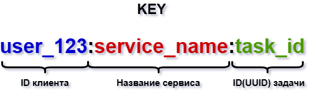
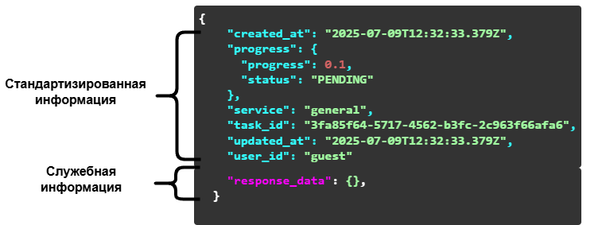

# Webhook Manager Service

## Описание сервиса

`Webhook Manager` хранит и отдает состояние длительных пользовательских задач через Redis. Сервис предоставляет HTTP API для CRUD-операций по задачам, WebSocket для потокового получения списка задач пользователя и встроенную Swagger-документацию.

Основные сущности:

- `key` - строковый ключ формата `{user_id}:{service}:{task_id}`, по которому выполняются CRUD-операции.
- `task` - объект задачи с общей структурой для всех сервисов и пользовательским `response_data`.




### Поля `task`

- `created_at` (`timestamp`) - время создания задачи
- `progress.progress` (`float`) - прогресс выполнения
- `progress.status` (`str`) - один из `PENDING`, `AWAITING`, `PROCESSING`, `READY`, `ERROR`
- `service` (`str`) - имя сервиса, который обрабатывает задачу
- `task_id` (`UUID`) - идентификатор задачи
- `user_id` (`str`) - идентификатор пользователя
- `updated_at` (`timestamp`) - время последнего обновления
- `response_data` (`str`) - служебные данные сервиса в JSON-строке

## API и ссылки

По умолчанию сервис поднимается на `http://localhost:10001`.

- Swagger UI: [http://localhost:10001/docs](http://localhost:10001/docs)
- OpenAPI JSON: [http://localhost:10001/api-docs/openapi.json](http://localhost:10001/api-docs/openapi.json)
- Healthcheck: [http://localhost:10001/health](http://localhost:10001/health)
- Metrics: [http://localhost:10001/metrics](http://localhost:10001/metrics)

### Основные маршруты

#### 1. Получение задачи по ключу

```http
GET /api/v1/storage/task?key={task_key}
```

Пример:

```text
/api/v1/storage/task?key=guest:general:384f4d80-4ed6-4032-2569-f02fd5e1afb9
```

#### 2. Создание задачи

```http
POST /api/v1/storage/task
Content-Type: application/json
```

```json
{
  "key": "guest:general:384f4d80-4ed6-4032-2569-f02fd5e1afb9",
  "task": {
    "created_at": "2025-07-09T12:51:27.948Z",
    "progress": {
      "progress": 0.1,
      "status": "PENDING"
    },
    "response_data": "string",
    "service": "general",
    "task_id": "3fa85f64-5717-4562-b3fc-2c963f66afa6",
    "updated_at": "2025-07-09T12:51:27.948Z",
    "user_id": "guest"
  }
}
```

#### 3. Удаление задачи

```http
DELETE /api/v1/storage/task?key={task_key}
```

#### 4. Получение всех задач пользователя

Можно передать `user_id` либо через query, либо через заголовок `X-User-ID`. Если заданы оба варианта, приоритет у `X-User-ID`.

```http
GET /api/v1/storage/tasks?user_id={user_id}
X-User-ID: {user_id}
```

Примеры:

```text
/api/v1/storage/tasks?user_id=guest
```

```http
GET /api/v1/storage/tasks
X-User-ID: guest
```

Если и query-параметр, и заголовок отсутствуют или пустые, сервис вернет `422 Unprocessable Entity`.

#### 5. Обновление прогресса задачи

```http
PATCH /api/v1/storage/update_progress
Content-Type: application/json
```

```json
{
  "key": "guest:general:384f4d80-4ed6-4032-2569-f02fd5e1afb9",
  "progress": {
    "progress": 0.1,
    "status": "PENDING"
  }
}
```

#### 6. Обновление служебной информации задачи

```http
PATCH /api/v1/storage/update_response_data
Content-Type: application/json
```

```json
{
  "key": "guest:general:384f4d80-4ed6-4032-2569-f02fd5e1afb9",
  "response_data": "{\"result\":\"ok\"}"
}
```

#### 7. Потоковое получение задач пользователя

```http
GET /api/v1/storage/ws
X-User-ID: guest
```

После подключения к WebSocket нужно отправить любое текстовое сообщение, например `PONG`. После этого сервер будет отправлять список задач пользователя с интервалом примерно в 1 секунду.

#### 8. Служебные маршруты

```http
GET /health
GET /metrics
GET /docs
GET /api-docs/openapi.json
```

## Конфигурация

Базовая конфигурация лежит в [config/development.toml](/mnt/sda/Development/GitLab/sova/webhook_manager/config/development.toml).

Значения по умолчанию:

- HTTP-сервер: `0.0.0.0:10001`
- Redis: `redis://0.0.0.0:6379`
- TTL задач в Redis: `3600` секунд
- Swagger UI: `/docs`

Конфигурация читается из:

1. `./config/development.toml`
2. `./config/{WEBHOOK_MANAGER__RUN_MODE}.toml`, если задан `WEBHOOK_MANAGER__RUN_MODE`
3. переменных окружения с префиксом `WEBHOOK_MANAGER__`

Примеры env-переменных:

```bash
export WEBHOOK_MANAGER__RUN_MODE=development
export WEBHOOK_MANAGER__SERVER__ADDRESS=0.0.0.0:10001
export WEBHOOK_MANAGER__STORAGE__REDIS__ADDRESS=redis://127.0.0.1:6379
```

## Требования

- Rust
- Redis
- Docker
- Prometheus и Grafana при необходимости мониторинга

## Запуск

### Локально

1. Поднимите Redis на `6379` или переопределите адрес через переменные окружения.
2. Убедитесь, что доступен конфиг `config/development.toml`.
3. Запустите сервис:

```bash
cargo run --bin run_server
```

После старта сервис будет доступен на `http://localhost:10001`.

### Docker

Сборка образа:

```bash
docker build -t webhook-manager .
```

Пример запуска контейнера:

```bash
docker run --rm \
  -p 10001:10001 \
  -e WEBHOOK_MANAGER__STORAGE__REDIS__ADDRESS=redis://host.docker.internal:6379 \
  webhook-manager
```

Если Redis запущен в другом контейнере или сети Docker, укажите соответствующий адрес вместо `host.docker.internal:6379`.

## Структура проекта

```yaml
.
├── config
│   └── development.toml
├── src
│   ├── bin
│   │   └── run_server.rs
│   ├── server
│   │   ├── router
│   │   │   ├── mod.rs
│   │   │   ├── models.rs
│   │   │   └── storage.rs
│   │   ├── config.rs
│   │   ├── error.rs
│   │   ├── mod.rs
│   │   └── swagger.rs
│   ├── storage
│   │   ├── redis
│   │   │   ├── config.rs
│   │   │   ├── error.rs
│   │   │   └── mod.rs
│   │   ├── config.rs
│   │   ├── error.rs
│   │   ├── mod.rs
│   │   └── models.rs
│   ├── config.rs
│   ├── errors.rs
│   ├── lib.rs
│   └── logger.rs
├── Dockerfile
└── README.md
```


