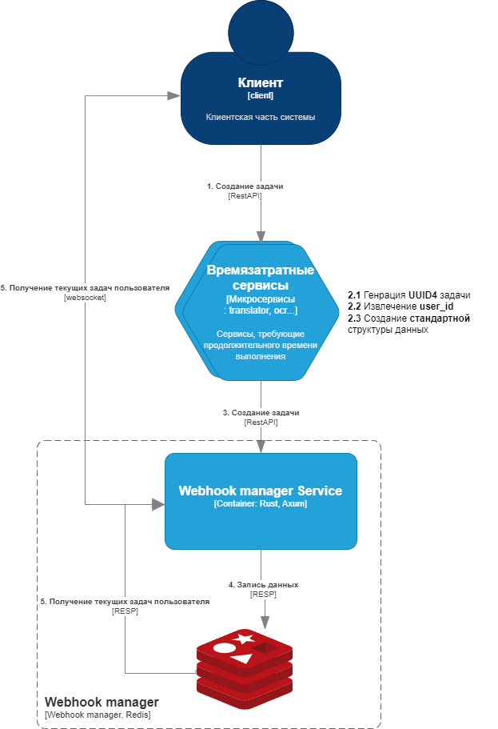

# Webhook Manager Service

## Описание сервиса

    Данный сервис представляет собой хранилище ресурсоёмких задач пользвателя, что повышает надежность выполнения задач и позволяет им не поддерживать постоянную связь с целевым сервисом.

### Структура проекта

```
.
├── config
│   └── development.toml        #Конфигурация сервиса
├── src                      	# Директория файлов логики работы сервиса
│   ├── bin  
│   │   └── run_server.rs       # Entrypoint сервиса
│   ├── server                	# Директория работы контроллеров (серверный слой)
│   │   ├── router  
│   │   │   ├── mod.rs
│   │   │   ├── models.rs
│   │   │   └── storage.rs  
│   │   ├── config.rs		    # Конфигурация сервиса
│   │   ├── error.rs
│   │   ├── mod.rs  
│   │   └── swagger.rs
│   ├── storage              	# Директория модуля хранилища
│   │   ├── redis               # Директория логики работы Redis
│   │   │   ├── config.rs	    # Конфигурация Redis
│   │   │   ├── error.rs	    # Ошибки Redis
│   │   │   └── mod.rs
│   │   ├── config.rs		    # Конфигурация хранилища
│   │   ├── error.rs		    # Ошибки хранилища
│   │   ├── mod.rs
│   │   └── models.rs  		    # Модели зачач
│   ├── config.rs		        # Конфигурация сервиса
│   ├── errors.rs		        # Ошибки сервиса
│   ├── lib.rs
│   └── logger.rs		        # Конфигурация логгера
├── cargo.toml
└── .env
```

Заполнить




## Основные требования

ПУСТОТА

## Установка

ПУСТОТА

## Запуск

ПУСТОТА

### Вручную

ПУСТОТА

### Docker-compose

ПУСТОТА
